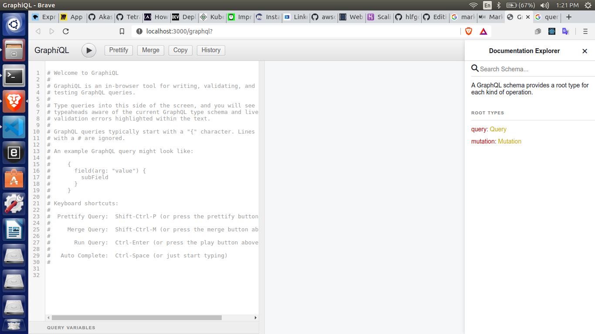
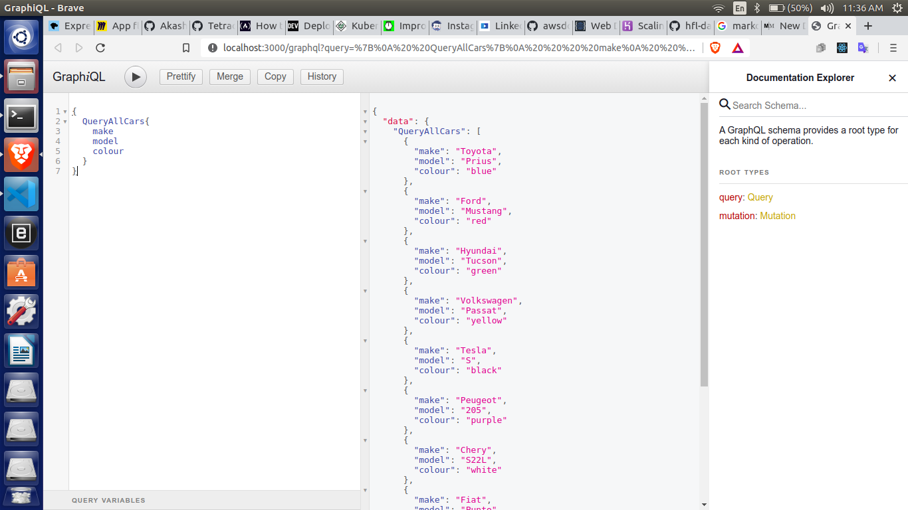
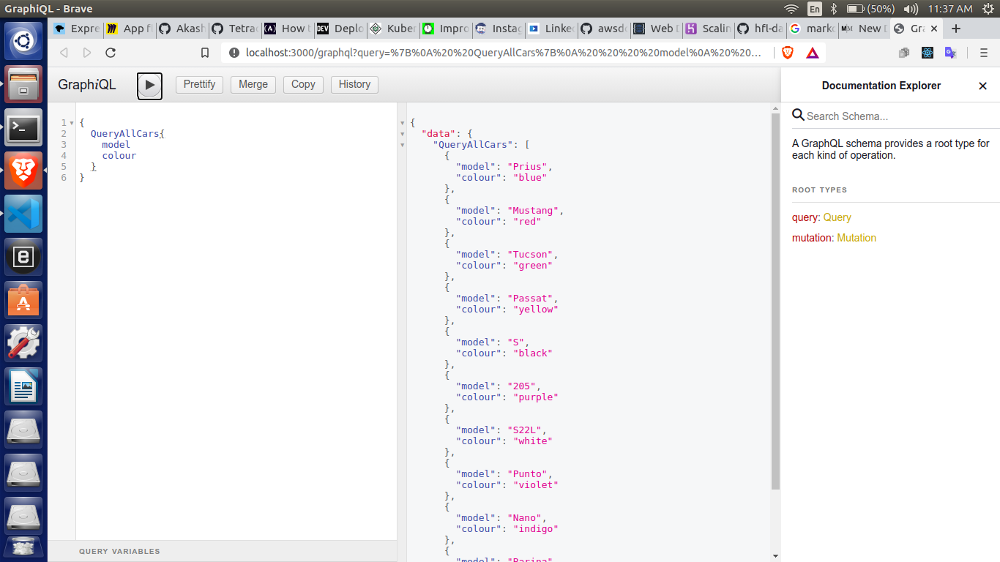
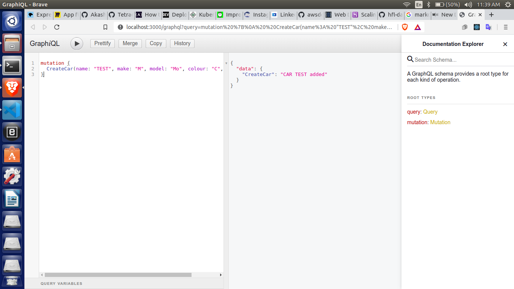

Hello there mates. Hope everyone's safe out there. This is Akash, working as Systems Engineer in TCS where I do Security Analysis for applications. Keeping that aside, I am a blockchain developer working on Hyperledger Fabric.

Chaincode is the smart contract that we write to implement business logic. Inorder to make the users to interact with chaincode we have cli tool and to access from various other applications we have many SDKs written in many languages. When we have end-to-end application, one way we interact with fabric network is using APIs. Here in this article I would like to show a new way of interacting with fabric network using GraphQL and how we can make Ultra-Rich queries using the same. I will give some basic introduction on what graphql is. I assume people reading this article has worked with hyperledger fabric atleast as a beginner.

## Scenario
Say for example we have a schema for user: Username, Email, Contact, Gender. If we need only Username and Gender, we need to write an API for returning those two. If we need email and contact, we need to write an API for that. And if we want all together there will be another API for that. But with GraphQL we can get whatever we need by just exposing one API. Lets see how!!

## What is GraphQL?
GraphQL is an open-source data query and manipulation language for APIs and a runtime for fulfilling queries with existing data. With GraphQL we can specify what exactly we need as part of query. GraphQL solves both over-fetching and under-fetching issues by allowing the client to request only the needed data. Since the client now has more freedom in the fetched data, development is much faster with GraphQL.

## SETUP

For this article I made use of fabcar that is part of fabric-samples provided by hyperledger fabric. In this fabcar chaincode, we have a schema for CAR with following fields: Make, Model, Colour, Model. Also we have invoke.js and query.js which uses fabric-network npm module to interact with peers and orderers. I will be making some modifications to query and invoke files to make it useful as required. Let's clear the network and remove stopped containers, prune the docker volume and network so that there wont be any hurdles in the process. To perform this, execute below script in fabcar directory.

```sh
$ ./networkDown.sh
```

Next lets start the network

```sh
$ ./startFabric.sh
```

## Writing Code

Now you have the network up and running with peers, orderers, CAs and couchDBs. Create a new directory named gql in fabcar directory and initiate a new npm package.

```sh
$ mkdir gql
$ cd gql
$ npm init
```
Give all the necessary details. Install all the necessary modules. Here we are writing an express application.

```sh
$ npm i express express-graphql graphql-tools fabric-network
```

Next we shall write basic express app.

```js
//index.js

import express from 'express';

const PORT = process.env.PORT || 3000

const app = express();
app.use(express.urlencoded({ extended: true }));
app.use(express.json());

app.use((err, req, res, next) => {
    res.locals.error = err;
    if (err.status >= 100 && err.status < 600) {
        res.status(err.status);
    } else {
        res.status(500);
        res.json({
          error: err
        })
    }
});

app.listen(PORT, () => console.log(`Running server on port localhost:${PORT}`));


```

We have two things with which we can interact with GraphQL: Query and Mutation. Query is equivalent to GET method in REST and Mutation is equivalent to POST,PUT. We have 'typedefs' in graphql where we specify the schema for data and 'resolvers' where we write logic part as shown below. We import two modules namely express-graphql and graphql-tools.

```js
// add this to query.js
import { graphqlHTTP } from 'express-graphql';
import { makeExecutableSchema } from 'graphql-tools';
const query = require('./query')

const fabcar_typeDefs = `
    type Car {
        make: String
        model: String
        colour: String
        owner: String
    }

    type Query {
        QueryCar(name: String): Car
        QueryAllCars: [Car]
    }
`

const fabcar_resolvers = {
    Query: {
        QueryCar: (_, { name }) => {
            return new Promise(async (resolve, reject) => {
                var result = await query(['queryCar', name])
                console.log(JSON.parse(result))
                resolve(JSON.parse(result))
            })
        },
        QueryAllCars: () => {
            return new Promise(async (resolve, reject) => {
                var result = await query(['queryAllCars'])
                var parsedResult = JSON.parse(result)
                var response = []
                parsedResult.forEach(data => {
                    response.push(data.Record)
                })
                console.log(response)
                resolve(response)
            })
        }
    }
}

const schema = makeExecutableSchema({
    typeDefs: [
        fabcar_typeDefs
    ],
    resolvers: [
        fabcar_resolvers
    ]
});
```

Here we have a typeDef type 'Car' with fields: make, model, colour, model. Also we specified type Query which implements two methods QueryCar which takes 'name' input and returns Car, QueryAllCars which returns array of Cars. Resolvers implemented the logic. We have to write query function which interacts with fabric network and gets our data. We shall make some minor modifications to the query script.

```js
// query.js

'use strict';

const { Gateway, Wallets } = require('fabric-network');
const path = require('path');
const fs = require('fs');

module.exports = async function query(array) {
    try {
        const ccpPath = path.resolve(__dirname, '..', '..', 'test-network', 'organizations', 'peerOrganizations', 'org1.example.com', 'connection-org1.json');
        const ccp = JSON.parse(fs.readFileSync(ccpPath, 'utf8'));

        const walletPath = path.join(process.cwd(), 'wallet');
        const wallet = await Wallets.newFileSystemWallet(walletPath);
        console.log(`Wallet path: ${walletPath}`);

        const identity = await wallet.get('appUser1');
        if (!identity) {
            console.log('An identity for the user "appUser" does not exist in the wallet');
            console.log('Run the registerUser.js application before retrying');
            return;
        }

        const gateway = new Gateway();
        await gateway.connect(ccp, { wallet, identity: 'appUser1', discovery: { enabled: true, asLocalhost: true } });

        const network = await gateway.getNetwork('mychannel');

        const contract = network.getContract('fabcar');

        var result = await contract.evaluateTransaction(...array);

        return result
    } catch (error) {
        console.error(`Failed to evaluate transaction: ${error}`);
        process.exit(1);
    }
}
```
This query function takes an array as input and evaluates transaction and returns the response.

```js
app.get('/', (_, res) => {
    res.redirect('/graphql');
}).use('/graphql', graphqlHTTP(() => ({
    schema: schema,
    graphiql: true,
})));
```

Here we are loading above written 'schema' to graphql server. Setting 'graphiql' to true gives you a UI to interact with graphql server. After writing all the code, index.js looks like this. Make sure you have the query.js in gql directory.

```js
// index.js

import express from 'express';
import { graphqlHTTP } from 'express-graphql';
import { makeExecutableSchema } from 'graphql-tools';
const query = require('./query')

const PORT = process.env.PORT || 3000

const app = express();
app.use(express.urlencoded({ extended: true }));
app.use(express.json());

app.use((err, req, res, next) => {
    res.locals.error = err;
    if (err.status >= 100 && err.status < 600) {
        res.status(err.status);
    } else {
        res.status(500);
        res.json({
          error: err
        })
    }
});

const fabcar_typeDefs = `
    type Car {
        make: String
        model: String
        colour: String
        owner: String
    }

    type Query {
        QueryCar(name: String): Car
        QueryAllCars: [Car]
    }
`

const fabcar_resolvers = {
    Query: {
        QueryCar: (_, { name }) => {
            return new Promise(async (resolve, reject) => {
                var result = await query(['queryCar', name])
                console.log(JSON.parse(result))
                resolve(JSON.parse(result))
            })
        },
        QueryAllCars: () => {
            return new Promise(async (resolve, reject) => {
                var result = await query(['queryAllCars'])
                var parsedResult = JSON.parse(result)
                var response = []
                parsedResult.forEach(data => {
                    response.push(data.Record)
                })
                console.log(response)
                resolve(response)
            })
        }
    }
}

const schema = makeExecutableSchema({
    typeDefs: [
        fabcar_typeDefs
    ],
    resolvers: [
        fabcar_resolvers
    ]
});

app.get('/', (_, res) => {
    res.redirect('/graphql');
}).use('/graphql', graphqlHTTP(() => ({
    schema: schema,
    graphiql: true,
})));

app.listen(PORT, () => console.log(`Running server on port http://localhost:${PORT}`));

```

I have added this start script to package.json to compile the code using babel

```json
"scripts": {
    "start": "nodemon ./index.js --exec babel-node -e js"
 },
```

Run the code using this command in gql directory.

```sh
$ npm start
```

Now you can navigate to port in which you made your application to run. It looks like this. It is from here you can interact with graphql.

**NOTE**: graphiql should be set to 'false' in production.



Lets make a query to fetch all cars from fabric network and specify only make, model and colour to return.



Here we can see that only make, model and colour details are returned to UI. Lets make another query to fetch only model and colour.



Here we can see only model and colour details are returned to UI. By this you got an idea on how we can use graphql to make queries. One important point to note here is we are exposing only one endpoint '/graphql' and it is to this endpoint we are sending our request data.

In the same way we can write mutations to invoke CreateCar by using graphql. For that you need to add few lines to typeDef, resolver and modify invoke.js.

```js
// invoke.js

'use strict';

const { Gateway, Wallets } = require('fabric-network');
const fs = require('fs');
const path = require('path');

module.exports = async function invoke(array) {
    try {
        const ccpPath = path.resolve(__dirname, '..', '..', 'test-network', 'organizations', 'peerOrganizations', 'org1.example.com', 'connection-org1.json');
        let ccp = JSON.parse(fs.readFileSync(ccpPath, 'utf8'));

        const walletPath = path.join(process.cwd(), 'wallet');
        const wallet = await Wallets.newFileSystemWallet(walletPath);
        console.log(`Wallet path: ${walletPath}`);

        const identity = await wallet.get('appUser1');
        if (!identity) {
            console.log('An identity for the user "appUser1" does not exist in the wallet');
            console.log('Run the registerUser.js application before retrying');
            return;
        }

        const gateway = new Gateway();
        await gateway.connect(ccp, { wallet, identity: 'appUser1', discovery: { enabled: true, asLocalhost: true } });

        const network = await gateway.getNetwork('mychannel');

        const contract = network.getContract('fabcar');

        const responce = await contract.submitTransaction(...array);
        console.log('Transaction has been submitted');

        await gateway.disconnect();
        return responce
    } catch (error) {
        console.error(`Failed to submit transaction: ${error}`);
        process.exit(1);
    }
}

```

And in index.js these lines have to be added.

```js
// in index.js

	const invoke = require('./invoke')

// Add this to fabcar_typeDefs at last
    type Mutation {
        CreateCar(name: String, make: String, model: String, colour: String, owner: String): String
    }
    
// Add this to fabcar_resolvers

	Mutation: {
        CreateCar: (_, { name, make, model, colour, owner }) => {
            return new Promise(async (resolve, reject) => {
                var result = await invoke(['createCar', name, make, model, colour, owner])
                console.log(JSON.parse(result))
                resolve(`CAR ${name} added`)
            })
        }
    }
```

By implementing this we can invoke transactions.



## PROS

Using GraphQL you can expose just one endpoint and make all requests using that. Also as we are able to query data as we want, we can reduce the weight of chaincode query functions. Also GraphQL was developed by Facebook for its internal purposes and is opensource. So we can expect good improvements.

## CONS

Though we have many advantages, disadvantages need some attention. Making complex queries can impact the performance of application. GraphQL can send only data but REST can send anything including files. These issues need to be addressed or developers need to take necessary precautions while designing their fabric products to implement GraphQL

## CONCLUSION

This article conveys that GraphQL can help developers to write much good way while writing APIs. There can be many other ways but here I am presenting just one of such ways. We can see more advancements in the tech and also Hyperledger Fabric to make it as the best platform to development Blockchain applications. You can find source code for this [here](https://github.com/Akash76/fabric-graphql). Please feel free to fork the repo can make it useful for your applications.
